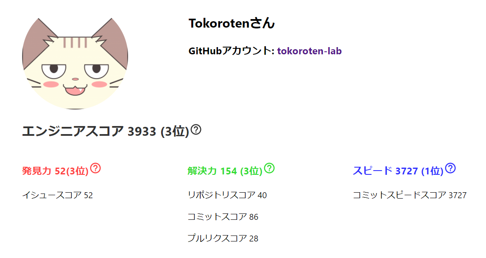
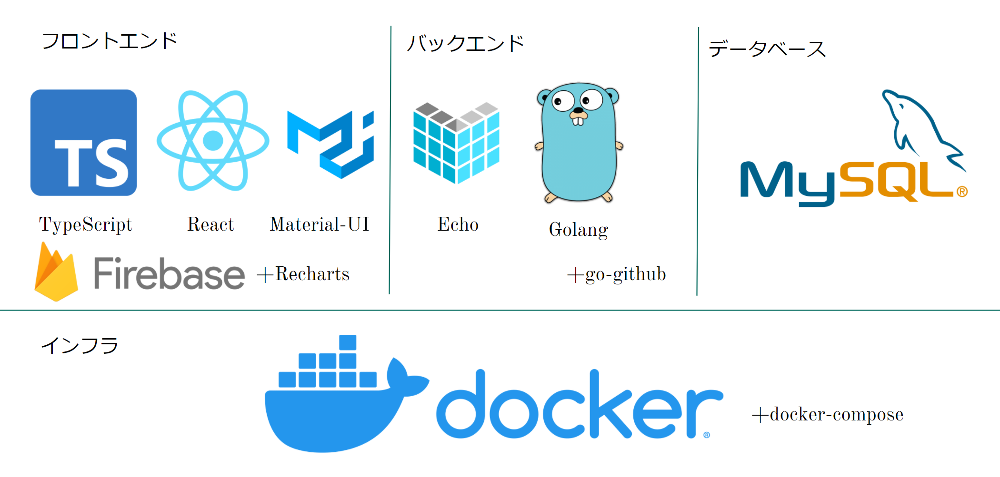
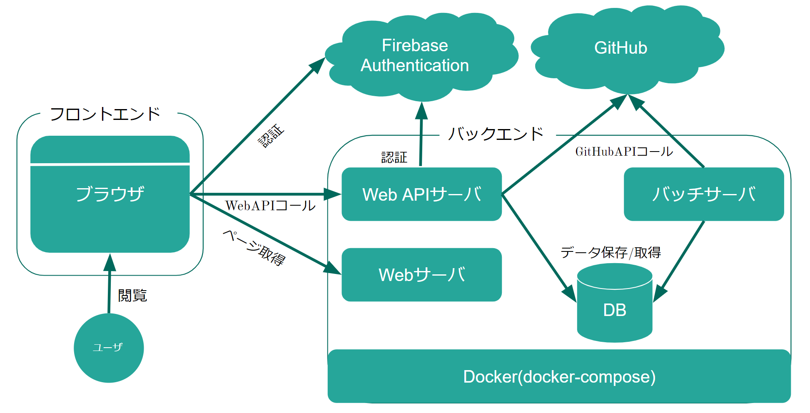

## 概要

本プロダクトは、新卒エンジニア採用担当向けのエンジニアの能力を可視化するWebサービスです。

採用担当の「会社にマッチしているエンジニアを採用したいがミスマッチがある」といった課題を解決するために作成しました。

現状の選考方法の例としては以下のようなものがあります。

- 書類選考
- 面接
- 筆記試験
- コーディイングテスト

これらは、本番一発勝負であったり選考のためだけに準備をしてくる場合が多いと思います。
その場合、エンジニアが本当はどんな人でどんな能力に長けているのかといった点は見えづらいのではないかと考えています。

その問題を解決するために本プロダクトでは、エンジニアのGitHubの普段の活動を分析し、能力として可視化します。

エンジニアの評価軸は、以下の通りです。

- 発見力 (課題を発見する能力)
  - イシュースコア
- 解決力 (課題に取り組む能力)
  - リポジトリスコア
  - コミットスコア
  - プルリクスコア
- スピード (課題に取り組む速さ)
  - コミットスピードスコア



### 参考資料

https://drive.google.com/file/d/15qCIAcWko9MW1Wl4BE4UNkf-0Wpj84wz/view?usp=sharing


## 利用技術



## アーキテクチャ



## 動作確認

2.と3.は初回時限定なので1度実行した後は、DBの変更がなければ行う必要はない

1. `make up`でプロダクトを立ち上げる
2. `make db/init`でDBを作成する(初回時のみ)
3. `make flyway/migrate`でDBのマイグレーションを行う(初回時のみ)
4. `http://localhost:3000`にアクセスする

## 各機能の設定

### フロントエンド

- ページURL: http://localhost:3000

### フロントエンド

- エンドポイント: http://localhost:1323

### データベース

- ポート: 3306

## コマンド一覧

`Makefile`に基本的なコマンドが定義されている。

コンテナ全体を起動
```
make up
```

特定のコンテナのみ起動
```
make container=db up
```

コンテナを削除
```
make down
```

データベースに接続
```
make db/client
```

データベースを初期化
```
make db/init
```

データベースを削除
```
make db/drop
```
